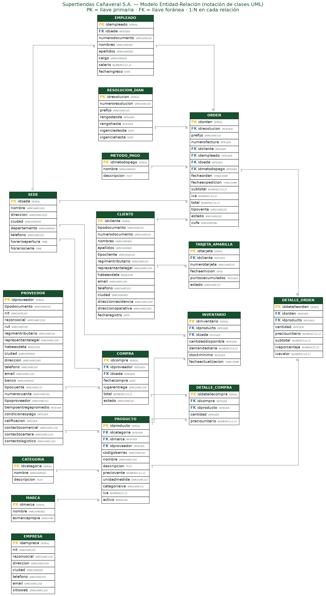

# Supertiendas Cañaveral — Aplicación web y base de datos relacional

Proyecto de la asignatura **Bases de Datos** — Universidad del Valle.
Aplicación web en **Django** conectada a **PostgreSQL** para la gestión de datos de una
empresa real del Valle del Cauca.

---

## La empresa

**Supertiendas Cañaveral S.A.** es una cadena de supermercados del Valle del Cauca. Cuenta
con **16 tiendas**: 9 en Cali y 7 en Palmira, Jamundí, Candelaria, Buga, Tuluá, Zarzal y
Roldanillo. Vende productos de consumo masivo al por mayor y al detal, y maneja una marca
propia, **Doña Lupe**.

* Sitio web: <https://supertiendascanaveral.com.co>
* Compras en línea: <https://www.domicilioscanaveral.com>
* Facebook: [@SupertiendasCanaveralOficial](https://www.facebook.com/SupertiendasCanaveralOficial/)

> La información de la empresa proviene de fuentes públicas. Las transacciones (clientes,
> ventas, empleados, proveedores) son **datos sintéticos**: ver [`DOC_IA.md`](DOC_IA.md).

---

## Diagrama Entidad-Relación



16 entidades · 18 relaciones · notación de clases UML (PK = llave primaria, FK = llave foránea).
También disponible en [`docs/mer.svg`](docs/mer.svg) y como fuente en [`docs/mer.dot`](docs/mer.dot).

---

## Instalación

### 1. Requisitos
* Python 3.10 o superior
* PostgreSQL 14 o superior (probado en PostgreSQL 16)

### 2. Entorno y dependencias
```bash
python -m venv venv
source venv/bin/activate          # Windows: venv\Scripts\activate
pip install -r requirements.txt
```

### 3. Crear la base de datos
```sql
CREATE ROLE canaveral_user LOGIN PASSWORD 'canaveral2025';
CREATE DATABASE canaveral_db OWNER canaveral_user;
GRANT ALL PRIVILEGES ON DATABASE canaveral_db TO canaveral_user;
```

### 4. Credenciales
Las contraseñas **no** están en `settings.py`: se leen de un archivo `.env`
(que está en el `.gitignore`).
```bash
cp .env.example .env      # ajusta los valores si tu instalación difiere
```

### 5. Migraciones y datos
```bash
python manage.py migrate          # crea las 16 tablas, las 3 vistas y los 2 triggers
python manage.py generar_datos    # genera ~5.600 registros sintéticos
```

### 6. Ejecutar
```bash
python manage.py runserver
```
* **Aplicación web**: <http://127.0.0.1:8000/>
* **Panel de administración**: <http://127.0.0.1:8000/admin/>
  (crear usuario con `python manage.py createsuperuser`)

---

## Módulos de la aplicación web

| Ruta | Módulo | Operaciones |
|---|---|---|
| `/` | Panel de gestión | Indicadores, ventas por mes, alertas de stock |
| `/clientes/` | **Clientes** | Crear · Consultar · Editar · Eliminar |
| `/proveedores/` | **Proveedores** | Crear · Consultar · Editar · Eliminar |
| `/productos/` | **Productos / Insumos** | Crear · Consultar · Editar · Eliminación **lógica** |
| `/inventario/` | Gestión de inventarios | Días de stock, categoría de estado y acción recomendada |
| `/facturas/` | **Facturas de venta** | Crear · Consultar · **Anular** (no editable ni eliminable) |
| `/pedidos/` | **Órdenes de pedido** | Crear · Consultar · Recibir · Cancelar |
| `/consultas/` | Consultas SQL | Las 20 consultas ejecutándose en vivo |

### Reglas de integridad implementadas
* No se puede **eliminar un cliente o un proveedor** que tenga facturas u órdenes asociadas.
* No se puede **registrar un producto ni una orden de pedido sin un proveedor previo**.
* Los **productos** usan eliminación lógica (`activo`), para no perder el histórico de inventario.
* Las **facturas y las órdenes de pedido** no se editan ni se eliminan: solo se anulan o cancelan.
* Los **campos críticos** (NIT, cédula, código de barras, número de factura) quedan bloqueados al editar.
* El **habeas data** (Ley 1581 de 2012) es obligatorio para registrar un cliente.
* Los **días de stock nunca se almacenan**: se calculan como `inventario ÷ demanda diaria`.

### Cálculo del IVA
Se aplican las cuatro categorías vigentes en Colombia:

| Categoría | Tarifa | Ejemplo |
|---|---|---|
| General | 19% | Aseo, licores, papelería |
| Diferencial | 5% | Café, harinas, pastas, azúcar |
| Exento | 0% | Sí causa impuesto, con tarifa cero |
| **Excluido** | — | Arroz, papa, banano, carne, leche: **el sistema no calcula nada** |

### Categorías de inventario (días de stock)

| Días de stock | Estado | Acción recomendada |
|---|---|---|
| 0 días | AGOTADO | Pedido inmediato |
| Menos de 5 | CRÍTICO | Pedido de emergencia |
| Entre 5 y 15 | ALERTA | Realizar pedido normal |
| Más de 15 | SEGURO | Mantener monitoreo |

---

## Comandos disponibles

```bash
python manage.py generar_datos --limpiar         # regenera todos los datos
python manage.py generar_datos --ordenes 1000    # más transacciones
python manage.py generar_datos --seed 42         # otra semilla (reproducible)

python manage.py consultas_validacion            # las 20 consultas en consola
python manage.py consultas_validacion --grupo basicas
python manage.py consultas_validacion --n 13     # solo la consulta 13

python generar_mer.py                            # regenera el diagrama MER
```

---

## Scripts SQL

| Archivo | Contenido |
|---|---|
| `sql/01_ddl_supertiendas_canaveral.sql` | Esquema completo: 16 tablas con todas las restricciones |
| `sql/02_datos_supertiendas_canaveral.sql` | Carga de datos: ~5.600 sentencias `INSERT` |
| `sql/03_consultas_sql.sql` | Las 20 consultas (10 básicas + 10 complejas) |
| `sql/04_vistas_y_triggers.sql` | Reto opcional: 3 vistas + gestión automática de inventario |

Carga alternativa sin Django:
```bash
psql -U canaveral_user -d canaveral_db -f sql/01_ddl_supertiendas_canaveral.sql
psql -U canaveral_user -d canaveral_db -f sql/02_datos_supertiendas_canaveral.sql
```

---

## Reto opcional (implementado)

1. **Índices** sobre las columnas más consultadas: fecha, sede, cliente y estado de la
   factura; producto del detalle; categoría, proveedor y nombre del producto; documento del
   cliente; proveedor de la orden de pedido.
2. **Tres vistas** de consultas recurrentes:
   * `vw_dias_stock` — días de stock, categoría de estado y acción recomendada.
   * `vw_ventas_mensuales` — ventas por sede y mes.
   * `vw_desempeno_proveedores` — cumplimiento y monto comprado por proveedor.
3. **Gestión automática del inventario con PL/pgSQL**:
   * `trg_compra_recibida` — al marcar una orden de pedido como **RECIBIDA**, suma
     automáticamente las unidades al inventario de la sede.
   * `trg_venta_descuenta_stock` — al facturar una venta, descuenta las unidades del stock.

---

## Volumen y sesgos de los datos

**5.599 registros** en total, de los cuales **3.194 son transaccionales**
(mínimo exigido: 1.000).

Los datos **no son uniformes**: se introdujeron sesgos intencionales para que las consultas
resulten relevantes.

| Dimensión | Sesgo |
|---|---|
| Estado de la factura | 82% pagada · 12% pendiente · 6% anulada |
| Canal de venta | 78% presencial · 22% en línea |
| Cantidad por línea | 1–2 unidades domina; cola larga hasta 12 |
| Tipo de cliente | 82% natural · 18% jurídico |
| Habeas data | ~93% autoriza el tratamiento de datos |
| Calificación de proveedores | La mayoría entre 4 y 5; unos pocos malos |
| Estado del inventario | 4% agotado · 12% crítico · 26% alerta · 58% seguro |
| Catálogo | ~4% de productos descontinuados (eliminación lógica) |
| Fechas | Repartidas de forma no uniforme entre 2024 y 2025 |

---

## Estructura del proyecto

```
canaveral/            Configuración de Django (PostgreSQL, .env)
supermercado/
  models.py           Los 16 modelos
  views.py            CRUD de las 5 entidades + inventario + consultas
  forms.py            Formularios con las reglas de negocio
  consultas.py        Las 20 consultas SQL
  admin.py            Panel de administración
  migrations/
    0001_initial.py               Tablas, UNIQUE, CHECK, índices
    0002_ddl_vistas_triggers.py   Reglas del DDL + vistas + triggers PL/pgSQL
  management/commands/
    generar_datos.py              Generador de datos sintéticos
    consultas_validacion.py       Ejecuta las 20 consultas en consola
templates/supermercado/           Plantillas HTML
docs/mer.png                      Diagrama entidad-relación
sql/                              Scripts SQL (DDL, datos, consultas, vistas, triggers)
DOC_IA.md                         Documentación obligatoria del uso de IA
```
